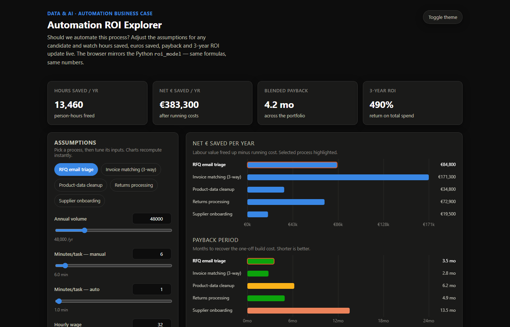

# Automation ROI Explorer


Picture a COO at a mid-size distributor with budget to automate one back-office process at a time and five teams each certain theirs should go first. Point this at their backlog and it answers the real question with numbers: on the seeded processes it puts invoice matching first — **€171,300/yr net at a 2.8-month payback** — and the full sequenced portfolio frees **13,460 hours and €383,300/yr net**. Build the wrong one first and that gap is the money left on the table.



Every back-office team has a queue of manual processes they could automate and not enough budget to do all of them. The interesting question isn't "can we automate this" — it's "which one first, and is it actually worth it?" This tool puts numbers on that: hours saved, euros saved, payback period, and 3-year ROI for each candidate, so the backlog gets ranked by value instead of by whoever asked loudest.

**Business case:** [`docs/BUSINESS_CASE.md`](docs/BUSINESS_CASE.md) — the COO scenario, the arithmetic behind every number above, and the ranked portfolio, with a one-page [executive summary PDF](deliverables/executive_onepager.pdf) drawn straight from the model.

I built it for the analytics side of the automation roles I've been applying to. Anyone can wire up an automation; being able to argue *which* one to build first, with the math shown, felt like the more useful thing to demonstrate.

There are two halves and they share one calculation. A stdlib-only Python package with a CLI, and a browser dashboard that runs the same math so you can drag a slider and watch the business case move in real time.

## The dashboard, and why the charts are hand-drawn

The dashboard is a single offline HTML file. Open it, adjust a process's sliders (volume, minutes per task, wage, coverage, build and running cost) and the KPIs, charts, and ranked backlog all recompute instantly. No server, no CDN, no internet. Adjusted assumptions survive a refresh (saved in your browser's localStorage only); "Reset all" returns to the seed data. Typed values may exceed the slider ranges — the sliders are a convenience, not a model limit — and the field notes say so when you do.

**Sensitivity — what moves the number.** Below the two main charts there's a tornado chart for the selected process: each driver is moved ±10/20/30% (your pick) on its own while the rest stay put, and the bars span the resulting 3-year net benefit range, widest first — so the first CFO question ("and if coverage is only 60%?") has an answer on screen before it's asked. Under it, a stress band shows the case with *every* driver at its bad/good end at once. These are stress bounds on your current assumptions, not confidence intervals — the ±swing is itself an assumption, and the chart says so.

**Take the scenario with you.** Once the assumptions are tuned, the export card turns them into something you can hand over: a copy-paste text summary (assumptions, results, stress band — ready for an email), a CSV or JSON download of every process's inputs and results, and a print one-pager that swaps the app for a clean ranked table when you print. Everything is generated locally from the numbers on screen — nothing leaves the page, and the same scenario always exports byte-identical files.

The one decision I'm glad I made: the bar chart and the payback chart are drawn by hand on a `<canvas>` element. I could have pulled in Chart.js or D3, but that's a dependency, a CDN request, and a chunk of the "offline" promise gone. Drawing the bars, axes, tooltips, and the light/dark theming myself was more code, but the whole thing stays a single file you can double-click. The JavaScript `compute()` mirrors the Python `compute()` line for line, which is what keeps the dashboard and the CLI from ever disagreeing.

## Running it

The dashboard needs nothing installed — just open `web/index.html` (`start web/index.html` on Windows, `open web/index.html` on macOS).

The CLI is standard-library Python:

```
python -m roi_model                       # ranked backlog from the seed data
python -m roi_model --sort payback_months # rank by fastest payback
python -m roi_model --csv my_processes.csv
python -m roi_model --export-json out.json --export-csv out.csv
python -m roi_model --sensitivity "RFQ email triage"            # tornado, +/-20%
python -m roi_model --sensitivity "RFQ email triage" --swing 30
```

```
Automation backlog - ranked by net_benefit_3y (5 processes)

Process                         Hrs/yr    Net EUR/yr   Payback mo    3y ROI %        NPV 3y
-------------------------------------------------------------------------------------------
Invoice matching (3-way)         5,950       171,300          2.8       769.3       401,457
RFQ email triage                 2,800        84,800          3.5       582.2       193,538
Returns processing               2,700        72,900          4.9       408.4       157,870
Product-data cleanup             1,350        34,800          6.2       320.0        71,683
Supplier onboarding                660        19,500         13.5       111.3        28,253

Portfolio total: 13,460 hours/yr (~7.9 FTE at 1,700 productive h/yr), 383,300 EUR/yr net saving
```

Tests:

```
pip install pytest ruff
pytest -q
ruff check .
```

## Read this before trusting a number

The model is intentionally simple, and every assumption is out in the open and adjustable — that's the design, not a corner cut.

- The five seeded processes and their figures are synthetic. Swap in your own before deciding anything.
- Savings assume freed hours turn into real money (redeployed staff, avoided hires, less overtime). If the freed time just evaporates, treat the "saving" as capacity, not cash.
- Volumes, wages, and per-task times are held flat across three years. No ramp-up or seasonality.
- `coverage` is a single number for the share of volume the automation truly handles end to end. Real automations have a messy tail; be honest here.
- Costs exclude change management, risk, and the maintenance tail. NPV uses a flat 8% discount rate (`DISCOUNT_RATE`).
- Processes are scored independently — no shared platform costs, no one automation unlocking another.
- The sensitivity view stress-tests the assumptions you set, one driver at a time at a swing you pick. It shows how fragile the number is, not how likely any outcome is — there's no probability model behind it.

Use it to structure and compare the decision, then apply judgement.

## Layout

```
roi_model/            stdlib-only package: model.py (the math), data_load.py, cli.py
web/index.html        offline dashboard, mirrors the Python math
tests/                pytest suite with hand-computable fixtures
```

## What I'd do next

Model dependencies between processes — right now each one is scored in isolation, but in practice a shared platform cost or one automation unlocking another changes the ranking, and that's the part the current model can't see.

---

© 2026 Dimitres Kisimov — all rights reserved; published for portfolio review. See LICENSE. Seed data is synthetic.
